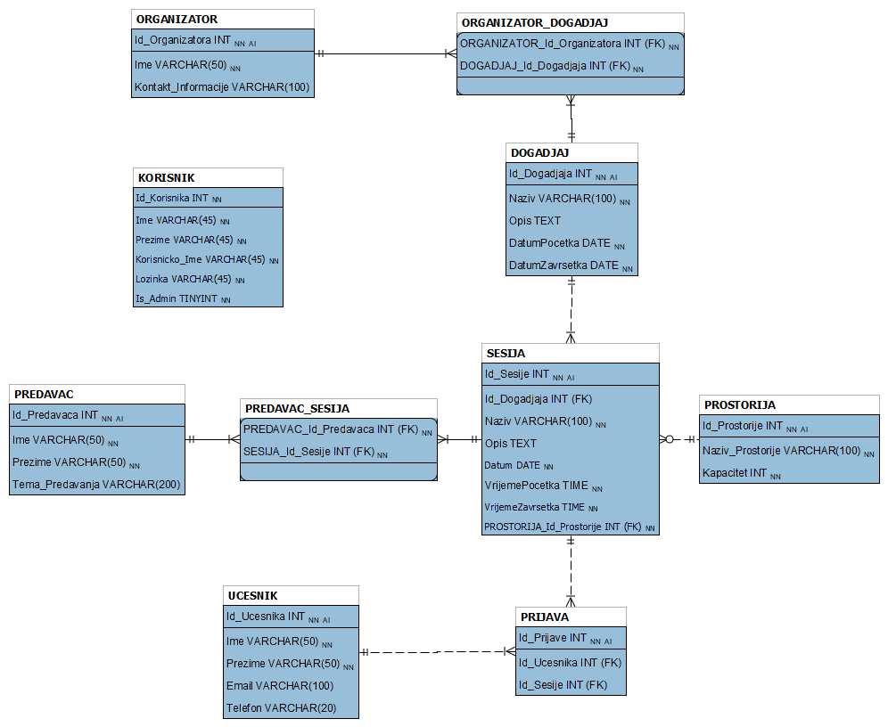

# Conference Center Management System

## Overview
The Conference Management System is a comprehensive desktop application designed to streamline the organization and management of conferences, events, sessions, speakers, participants, and venues. Built with C# and MySQL, this system provides administrators and regular users with intuitive tools to manage conference-related data efficiently.

## Features

### Administrator Features
- **CRUD Operations**: Full Create, Read, Update, and Delete functionality for:
  - Organizers
  - Events
  - Sessions
  - Rooms
  - Speakers
  - Participants
- **Linking Entities**: Easily link organizers to events and speakers to sessions.
- **Data Filtering**: Search and filter data across all entities for quick access.
- **Detailed Views**: Double-click any entry to view detailed information.
- **User Management**: Log in as an administrator to access all features.

### Regular User Features
- **View Data**: Browse organizers, events, sessions, rooms, and speakers (read-only).
- **Session Management**: Register or unregister participants for sessions.
- **Filtering**: Use filters to find relevant information quickly.

### Database
- **MySQL Integration**: Robust database schema with tables for all entities and their relationships.
- **Test Data**: Pre-populated with sample data for testing and demonstration.

## Technologies Used
- **Backend**: C#, .NET Framework
- **Database**: MySQL
- **Frontend**: Windows Forms (WinForms)

## Setup Instructions

### Prerequisites
- MySQL Server
- .NET Framework (version 4.5 or higher)
- MySQL Connector/NET

### Installation
1. **Database Setup**:
   - Run the SQL script `Skripta_Konferencijski_centar.sql` to create the database and tables.
   - Optionally, run `Testni_podaci.sql` to populate the database with sample data.

2. **Application Configuration**:
   - Update the connection string in the application's configuration file (`App.config`) to match your MySQL server details.

3. **Run the Application**:
   - Build and run the project in Visual Studio or deploy the executable.

## Usage
1. **Login**:
   - Use the provided credentials to log in as an administrator or regular user.
   
2. **Navigation**:
   - Administrators can navigate through tabs to manage different entities.
   - Regular users can view data and manage session registrations.

3. **Linking Entities**:
   - Use the "Uveži" (Link) buttons to connect organizers to events or speakers to sessions.

- Developed as part of a university course on Human-Computer Interaction.
